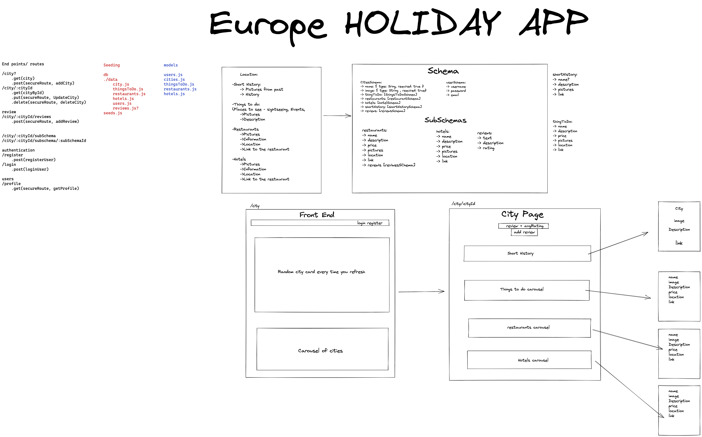
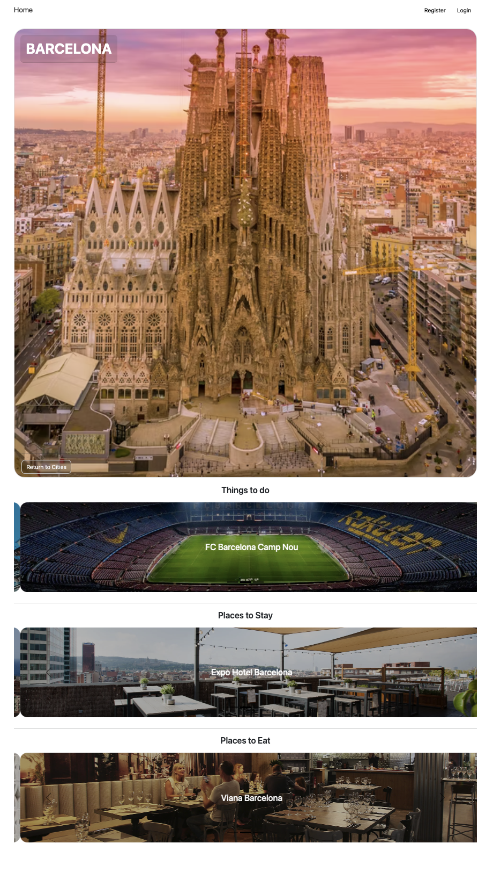

## SEI-project-three

# Project 3 - Europe Travel Guide

## Overview

The third of four projects on the Software Engineering Immersive course at General Assembly. I teamed up with [NicholasBotorog](https://github.com/NicholasBotorog) & [cencorroll](https://github.com/cencorroll) to create a fullstack MERN application.

Link to deployed project [Europe Travel Guide](#)  

## Table of Contents

- [Project Brief](#project-brief)
- [Technologies Used](#technologies-used)
- [Getting Started](#getting-started)
- [Bugs/Missing Features](#bugs-missing-features)
- [Development Reflections](#development-reflections)
  - [Challenges](#challenges)
  - [Wins](#wins)
  - [Dev Journal](#dev-journal)
- [Potential Future Updates](#potential-future-updates)
- [Contributors](#contributors)

## Project Brief
Group project (Team of three)  
Time frame: approx 1 week  
Brief: Build a fullstack MERN application
- Build a full-stack application by making your own backend and your own front-end  
- Use an Express API to serve your data from a Mongo database
- Consume your API with a separate front-end built with React
- Be a complete product which most likely means multiple relationships and CRUD functionality for at least a couple of models

Wireframe

## Technologies Used

#### Languages and Frameworks

#### Backend

#### Testing  

  

#### Dev-Tools
 

## Usage

### Europe Travel Guide

Europe Travel Guide App allows users to search european city destinations and find information on accommodation, places to eat and activities to take part in. Users can also view reviews that are left by registered users.

#### Navigation

- The home page currently displays all the city cards in the database. Users can search for specific cities or search a country to display all cities from said country. Clicking on a city will navigate to the individual city page
- Users can register or login to the app
- Registered users can leave reviews and rating for accommodations, activities or places to eat

- On a city page, three carousels display accomodation, activities and places to eat.
- Clicking through allows users to read a brief description of the location and leave a review if they are registered and logged in

## Comments/ Bugs

- The carousel have a bug where clicking on the item doesn't immediately navigate to the item’s page  
- The reviews are currently not organised in any particular way
- The way we designed our data models made it difficult to access certain information

## Development Reflections

### Challenges  

We wanted to try a different CSS framework and opted for TailwindCSS but couldn’t quite get it working properly with React so we had to revert to bootstrap, a framework we are more comfortable working with given the time restraints.
In hindsight, having multiple subschemas probably wasn’t the best way to do things as there were quite a few issues trying to access certain information.
Initial Git usage. 
Would sometimes forget to swap to the feature branch and end up making changes on the development branch.
Dealing with merge conflicts

### Wins  
First group project where we had to properly utilise Git to distribute workload. Managing and dealing with merges and conflicts definitely improved communication and understanding how to work better with each other.
Having being able to search through our database to find a specific city
Overall, we worked very well as a team and I feel we did manage to achieve what we set out to do even if it is lacking a little polish. 

## Dev Journal

### Approach

Work on backend first then on frontend
Build database
Model schemas
Controllers
Config
DB

Frontend
Navigation
App.js routing
Components
Utilities
Helpers
 
#### Day 1 - Planning & backend building
We had several ideas going in but decided on a type of travel guide. Initially it was worldwide but we decided to scale back and be a bit more realistic in terms of what we could achieve in the allotted time. 

We communicated through zoom and slack throughout the project to make sure we were up to date with each other on the project.

We planned out what was required for the project and chose the parts we wanted to work on. I focused on authentication and page structure from our design but in general we all chipped in on all aspects.

Excalidraw wireframe

Created a base file with all the basics everyone needed to start the project.

We checked in on each other during the coding to make sure we understood what was happening.
By the end of today we managed to get most of the backend functioning and should be able to begin seeding some data.

Seed, user data, authentication, controllers

We created a few cities each to add some data into our database. I added Scottish cities with places to stay, eat and things to do related to those cities.

Also added user registration and login post requests

#### Day 2 - seed data, added secure routes 
Edited tweaked some of the seeding data

#### Day 3/4 - seeding data into the database
This day started with some merge conflicts that took a little time to resolve.  
Did some research on possible css frameworks we can use as an alternative to Bootstrap. Decided to try Tailwind because some of the components seem really useful and are less restrictive compared to bootstrap but had trouble trying to use tailwindCSS React package, will try again tomorrow.  
Saw some interesting page piling effect packages for React, will do some research overnight.  
We ran into a problem where it was difficult to access data because of the relationship of our models, our review feature ties into all the other endpoints so hopefully we can get this working.

#### Day 5 - Frontend 
Started the frontend today
Unfortunately, the page piling effect we wanted to use required payment to use the more advanced features. A teammate was willing to pay for a licence but in the end we decided not to go this route.
Both myself and a teammate attempted to get tailwindCSS React working but to no effect so we decided to revert to using Bootstrap and SASS.  
Coded the routing for the app, created components for the frontend.  
Created register and login pages for frontend. 

  

Created individual pages for Cities, restaurants, hotels and places to eat.  
City Page

 

Things to do
 
After clicking on a carousel item you can see the individual item with a brief description. A link is also provided to the official website. If you are logged in you can leave a review for the individual item.  

Researched and tried to implement different React specific carousels but either those packages didn’t work or didn’t meet our needs.
I seeded more data into our database. 
Teammate added carousels to the individual city pages.

#### Day 6 -  Front End styling continued
Today we completed all the core functionally, and will continue with styling.
At the moment everything seems to be running very smooth.  
Teammate added a random featured city element on the index page that changes on each load, refresh.  
Styled the individual pages.  
Tweaked a bit of the styling on the index page to add hover effect.

#### Day 7 - More styling
Our last day had some issues, after our final merge into the development branch, the app became sluggish, and the carousels didn’t function well. We encountered no conflicts in our daily merge and so cannot pinpoint where the issue came from.  

**update*  
We haven’t changed any code but our app seems more responsive now, though the carousels still need a few clicks in order to click through to the items. We have no more time to troubleshoot this bug so will proceed with finalising the styling.

## Potential future updates

Improvements

  - [ ] Allow sorting of reviews
  - [ ] Optimising loading times by limiting the amount of cities displayed on index page
  - [ ] Add more cities, accommodations, activities and places to eat
  - [ ] Make mobile friendly

## Contributors 

[NicholasBotorog](https://github.com/NicholasBotorog)  
[cencorroll](https://github.com/cencorroll)
